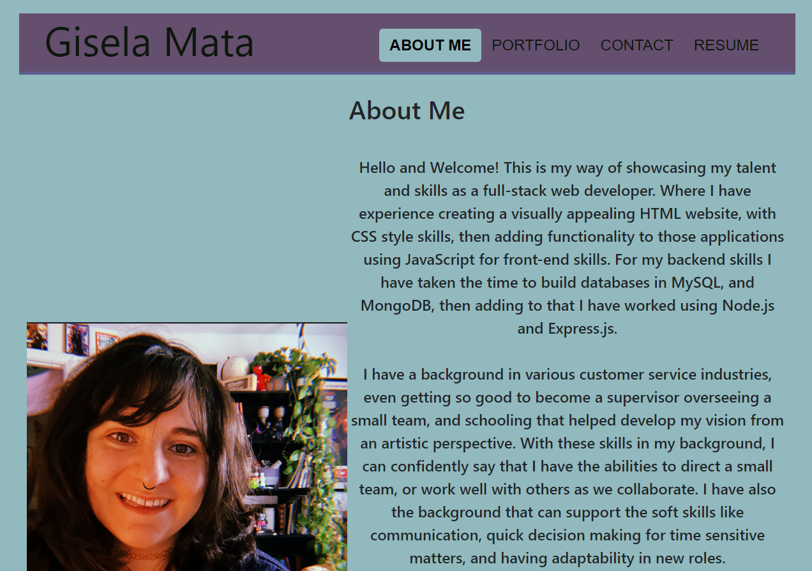
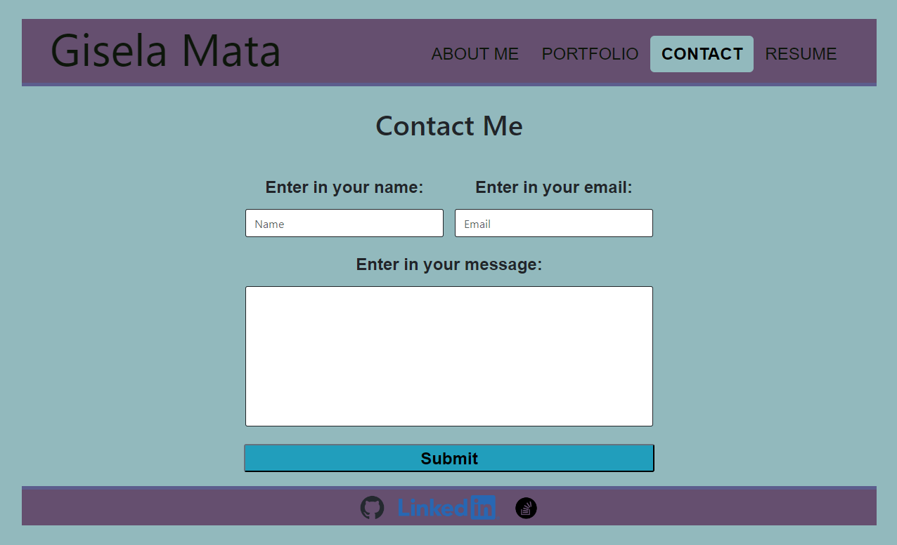

# Web-Developing-Portfolio
Web-Developing-Portfolio is a comprehensive showcase of a developer's projects, built using React and showcasing their proficiency in web development. 

## Table of Contents
- [Description](#description)
- [Screenshots](#screenshots)
- [Live Link](#live-link)
- [Technologies Used](#technologies-used)
- [Installation](#installation)
- [Features](#features)
- [Contribution Guidelines](#contribution-guidelines)
- [License](#license)
- [Questions](#questions)

## Description
The Web-Developing-Portfolio is a React-based application designed to serve as a comprehensive showcase of a developer's projects. It allows employers, and fellow developers, to assess the developer's proficiency in web development by providing a seamless browsing experience and showcasing various projects in a structured manner.

## Screenshots of application
### Home Page

### My Portfolio

### Contact Page

### My Resumes

## Live Link
A link of the live site will be placed [here!](https://example.com)

## Technologies Used
- HTML
- CSS
- Bootstrap
- JavaScript
- React
- Npm

## Installation
If you want to clone the repo and have this application on your local machine, you can follow these steps.
1. Clone the repo: `https://github.com/PotionSela/Webster-Developing-Portfolio`
2. Open VS Code, if you don't have VS Code, install it first.
3. In the terminal, type `npm create vite@4.4.1` you can name your project, select react, and then javascript.
4. Then type, `npm install` to install all the dependencies
5. After those steps, then you can type `npm run dev` to get the server to run.

## Features
In this project you will find I used HTML, CSS, and Bootstrap for styling the webpage, I used JavaScript and React for functionality of the site. I have a spot in this site so that anyone can send me their contact information, and any future employers can download the front and back sides of my resume. 

## Contribution Guidelines
If you want to contribute to this application, fork the repo to start your own journey with this application.

## License
There is no License for this project.

## Questions
If you have questions for the creator, you can contact me [here through my GitHub account!](https://github.com/PotionSela) or email me at giselamata27@gmail.com.